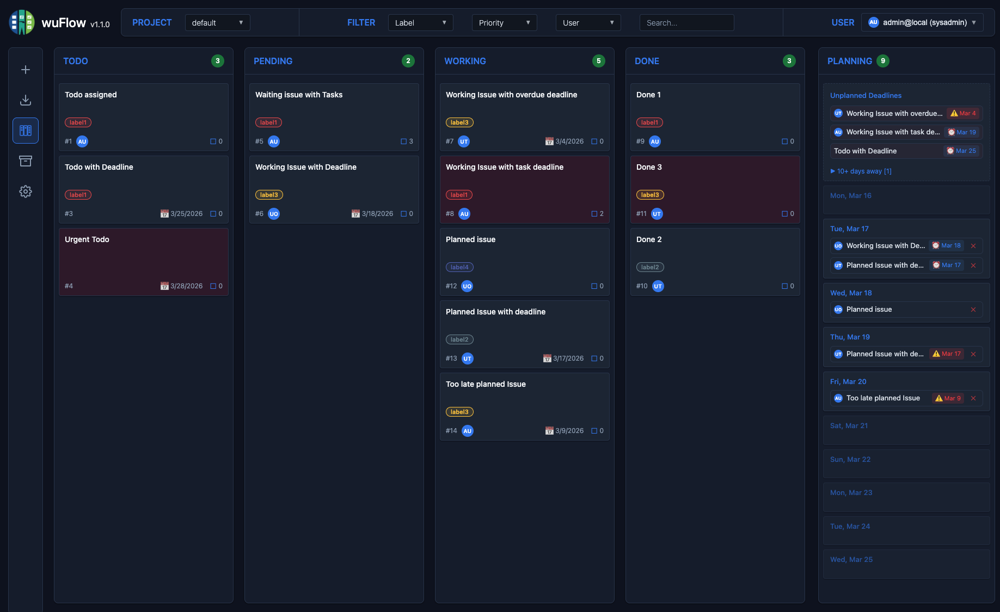

# wuFlow

[](https://opensource.org/licenses/Apache-2.0) 
[](https://github.com/pwurbs/wuflow/releases) 
[](https://github.com/pwurbs/wuflow/issues)  <br>
[](https://github.com/pwurbs/wuflow) 
[](https://goreportcard.com/report/github.com/pwurbs/wuflow) <br>
[](https://github.com/pwurbs/wuflow/pkgs/container/wuflow) <br>
[](https://sonarcloud.io/dashboard?id=wuflow-oss) 
[](https://sonarcloud.io/dashboard?id=wuflow-oss) 
[](https://sonarcloud.io/dashboard?id=wuflow-oss) 
[](https://sonarcloud.io/dashboard?id=wuflow-oss)


## Why another Agile board?
For me, Jira was the gateway to Agile methodology. I rely on Kanban everywhere—from professional DevOps teams to organizing my family life. But when Atlassian discontinued server licenses and forced a move to the cloud, I had to find an alternative. Jira had already become too expensive and morphed into a bloated "Moloch": complex to configure, burdened by long startup times, and plagued by frequent security updates for features we didn't even use.

I spent some time exhaustively testing self-hosted alternatives, hoping to find a replacement. Find the full tool comparison results here: <br>
[Beyond Jira: Reclaiming Agile Sovereignty with Open Source](https://medium.com/@pwurbs/beyond-jira-reclaiming-agile-sovereignty-with-open-source-14556d709c65).

 **My conclusion? None of them fully met my criteria.** Even the most highly recommended open-source tools suffered from deal-breaking flaws:

- **Missing Agile Core:** Most tools position themselves as Trello substitutes, not Jira replacements. They entirely lack release management (versions/milestones), SCRUM support, and robust backlog management.
- **Security Blind Spots:** Rampant dependency bloat unnecessarily increases the supply chain attack surface. I consistently found missing HTTP security headers (XSS risks), weak token management, and unmaintained packages.
- **No Daily Planning:** No tool successfully combined a classic Kanban workflow with flexible, side-by-side daily time management.

**The Solution: Make it!**

I realized the perfect balance between the structural depth of Jira and the simplicity of a modern board didn't exist. That’s why I started **wuflow**.

wuflow is an attempt to marry a clean, modern UI with the strict requirements of a sovereign, self-hosted agile engine. It is currently in its early stages, built strictly around a security-first and lean philosophy. It isn't a "Jira-killer" for everyone, but it is a definitive step toward true IT sovereignty.

Building wuflow is also a personal experiment to see how far AI-assisted development can go when building a tool from scratch while intentionally keeping the supply chain attack surface as small as possible. Ultimately, I just love making good things that work. There is a deep satisfaction in having full control over the concepts, code, and prioritization to build something that provides genuine value.

## The Result
wuFlow is a simple, modern, and lightweight issue tracking and planning application. It is designed to combine the immediate visual overview of a classic Kanban board with structural planning capabilities to help you organize tasks effectively without unnecessary complexity.
This tool wants to help you to organize, balance and track the work in a team to achieve a better **flow** of work by a transparent visualization. This is one of the main intentions of a [Kanban board](https://en.wikipedia.org/wiki/Kanban_board).
The usage is not limited to software development teams, it can be used by any person, group or even families that wants to organize and track their work.



We developed this tool having the following goals in mind:
- Create a **modern and lightweight** issue tracking solution focused on the mostly used core functions to ensure a good **flow** of work.
- Can be used **without expensive subscriptions** or being forced into the cloud.
- **Cover the core functions of legacy issue management tools** like Jira.
- **Avoid the complexity of existing solutions** like Jira for more stability, higher security, easy configuration and lower costs. 
- Bridge the gap between **structured Kanban management** and **daily planning**.
- Provide **full topic/task transparency** to a team, group or family.
- Don't rely on **heavy frameworks** or libraries which require dedicated skills and knowledge.
- Ensure **"Security by Design"** through strict headers, CSRF/XSS prevention, and rigorous testing.
- Slim and **modern software architecture** using only Go and Vanilla JavaScript.
- Rely only on **few dependencies** to significantly reduce the **supply chain attack surface**.
- **No tracking**, telemetry or any other "calling home" functions.
- **Easy** to deploy and use.
- **100% Open Source**.

## Features
- **Intuitive Planning & Kanban**: Combine flexible daily planning with a classic Kanban board view to easily organize your workflow side-by-side.
- **Projects**: Projects allow you to separate the visibility of issues for different teams, projects or topics. Each issue belongs to exactly one project.
- **Configurable Board Columns**: Adapt the board per project according to your workflow.
- **Release Management**: Group issues into named, time-boxed releases, track progress with a visual indicator and assign an owner responsible for a release.
- **Subtasks & Deadlines**: Break down larger issues into smaller, actionable tasks or checklists with individual deadlines.
- **Custom Labels**: Categorize and color-code issues with an easy-to-use label management system per project.
- **Advanced Filtering & Search**: Quickly find issues by filtering based on labels, priority, assignees, or text search.
- **Multi-user Support**: Built-in user management with role-based access, allowing safe concurrent editing of issues.
- **Rich Text Markdown Editor**: Write readable issue descriptions using a built-in Markdown editor with formatting tools and live preview.
- **Prioritization & Assignment**: Assign issues directly to specific users, flag important work with High Priority and order the issues per column.
- **Backlog Management**: Use the backlog view to plan your work by sorting issues and assigning them to releases.
- **Issue Archiving**: Keep your active board clean by archiving completed issues for later reference.
- **No dependencies** on external services or libs during runtime. Allows for air-gapped deployments.
- More features to cover core functions for agile teams are coming.

The app is currently only tested to run in the Chrome browser.

## Dependencies
As a contrast to the other tools, the supply chain is radically minimal. The production runtime ships:
- Go binary with embedded assets
- A few Go packages
- 2 vendored JS files: dompurify and marked — Rather than being reimplemented, these were deliberately vendored to leverage years of community scrutiny and proven security. They are bundled at build time, ensuring no external dependencies are loaded at runtime. 

Maintaining such a minimal dependency count is remarkable for a full-stack application in 2026. While this lean approach is currently unconventional, I believe it could represent a trend enabled by AI-assisted development. By leveraging AI to build logic rather than importing heavy third-party libraries, this project explores a new development paradigm. This 'make-over-buy' strategy is a deliberate security choice, designed to eliminate the risks inherent in modern, over-bloated dependency trees. Supply chain attacks (Log4j, polyfill.io or the XZ Utils backdoors) or unintended security flaws (like React2Shell) have proven that every dependency is a potential liability. Let’s see how successful this strategy proves to be. 

## Configuration
Configuration is done by either Envvar or command line argument using the following priority (highest to lowest):
1. Command-line flags (e.g., `-port 8080`)
2. Environment variables (e.g., `WF_PORT=8080`)
3. Internal default values

**Configuration options:**

| Title | Envvar name | argument name | Default | short description |
|---|---|---|---|---|
| HTTP Port | `WF_PORT` | `-port` | `8080` | The port to run the web server on. |
| Database Path | `WF_DBPATH` | `-dbpath` | `wuflow.db` | The path and name of the SQLite file. |
| Secret Key | `WF_SECRET_KEY` | `-secret-key` | *Random* | Used for JWT signing and session token hash. |
| Admin Email | `WF_INITIAL_ADMIN_EMAIL` | `-initial-admin-email` | `admin@local` | Email for the first sysadmin user created on initial startup. |
| Admin Password | `WF_INITIAL_ADMIN_PASSWORD` | `-initial-admin-password` | *None* | Password for the first sysadmin user. **Must be provided on first run.** |
| Log Level | `WF_LOG_LEVEL` | `-log-level` | `info` | Logging verbosity (`debug`, `info`, `warn`, `error`). |
| Secure Cookie | `WF_SECURE_COOKIE` | `-secure-cookie` | `true` | Restricts auth cookies to HTTPS. Disable (`false`) only for internal HTTP networks. |
| API Rate Limit | `WF_API_RATE_LIMIT` | `-api-rate-limit` | `true` | Enables per-user API rate limiting to prevent abuse. |
| Remote IP Header | `WF_REMOTE_IP_HEADER` | `-remote-ip-header` | *None* | Trusted HTTP header for detecting client IP behind a reverse proxy (e.g., `X-Forwarded-For`). Only set this when wuFlow's port is exclusively reachable through the trusted proxy. The proxy must **overwrite** (not append to) the header. |

Configuration Remarks:
- **Initial admin email/password** is **only** used to create the first sysadmin user on initial startup and store it in the database. For email, the default can be used, but the password **must** be defined for the initial startup and comply to the password policy (12 characters, no common passwords). The app won't start initially without a valid password. You can change email or password later in the user settings.
- If the **Secret Key** is not configured, a random key is generated on startup. This invalidates all sessions and forces users to login again. If you want to provide persistent sessions which survive restarts, you **must** provide a stable secret key. This key should have at least 32 characters, be a high-entropy random string and **must** be stored securely. Because it's used for JWT signing and session token hash, a **revealed or compromised key will compromise the security** of the entire application.
- **Secure Cookie** must be kept **enabled** for production environments. Otherwise, there is the risk that the critical security related cookies are sent over unencrypted connections. The Secure cookie flag requires TLS, so this only works correctly when the app runs behind a TLS-terminating reverse proxy. Setting this to false and going without a TLS terminating reverse proxy **is only recommended for internal and trustworthy HTTP networks**.
- The **Remote IP Header** setting is used to correctly detect the actual client IP when the app is running behind a reverse proxy. If empty, the client IP is directly taken from the TCP connection. If you are running the app behind a reverse proxy, you **must** set this to the HTTP header that the proxy sets with the actual client IP (e.g., `X-Forwarded-For` or `X-Real-IP`). Otherwise, the login rate limiting is based on wrong IP address information and the request logging contains the IP address of the reverse proxy instead of the actual client IP.
- **Timing parameters** are not configurable but are fixed at well-reasoned defaults. None of these require tuning for typical deployments.
  - *Server (transport layer):*
    - `ReadTimeout` — **15 s**: maximum time to read the full HTTP request (headers + body).
    - `WriteTimeout` — **15 s**: maximum time to write the full HTTP response.
    - `IdleTimeout` — **60 s**: closes keep-alive connections that have been idle.
  - *Server (application layer):*
    - Request timeout — **5 s**: per-request deadline propagated through all database calls; a slow or blocked query is cancelled rather than held open indefinitely.
    - Graceful shutdown drain — **15 s**: maximum time the server waits for in-flight requests to finish after receiving `SIGTERM`.
  - *Session / authentication:*
    - JWT access token — **15 min**: short-lived token embedded in the auth cookie.
    - Refresh token — **24 h**: backs the persistent session; renewed automatically on each access-token refresh.

## Deployment Options

### Via Container (Docker)
The recommended and easiest way to deploy wuFlow is using the pre-built container image. 
This is a minimal command to start the app initially for testing purposes in foreground mode. You should adapt it to your needs.
The version must be adapted to the latest release. There is no "latest" tag.

**Currently, the public image is only built for linux/arm64**

```bash
docker run -it \
  -p 8080:8080 \
  -e WF_INITIAL_ADMIN_PASSWORD="secure-pssw0rd" \
  -e WF_SECURE_COOKIE=false \
  -v /tmp:/data \
  -e WF_DBPATH="/data/wuflow.db" \
  ghcr.io/pwurbs/wuflow:1.0.0
```

Then you can access the app at `http://localhost:8080` and login with email `admin@local` and the configured password.

### Via Go (Source binary)
If you prefer running the application directly from the source code, ensure you have Go installed (version 1.25+), clone the repository, and run:

```bash
go run . -initial-admin-password "secure-pssw0rd" -secure-cookie=false
```

The same way, you can access the app at `http://localhost:8080` and login with email `admin@local` and the configured password.

### Reverse Proxy
As the app only offers unencrypted HTTP, **it is mandatory to run it behind a reverse proxy** (e.g. Nginx, Traefik) within the same envirnment that **handles TLS termination** and forwards requests to the app. Otherwise, it would not be possible to use the secure cookie flag, which is mandatory for the security of the application. The reverse proxy should also be configured to forward the actual client IP to the app using the configured **Remote IP Header**.

For the Remote IP Header to work correctly and securely:
- **Block direct access to wuFlow's port** — bind it to `localhost` or a private interface, or restrict it with a firewall rule, so it is not reachable from the internet. This is the foundational requirement: if an attacker can connect to wuFlow directly, they can set any `X-Forwarded-For` header they like, bypassing IP-based rate limiting entirely.
- **The proxy that sees the real client IP must set the header authoritatively.** wuFlow reads the first entry of a comma-separated `X-Forwarded-For` value. That entry is only trustworthy if the proxy closest to the client strips any client-supplied header and sets its own. If your reverse proxy itself sits behind a CDN or runs as a container (so its direct peer is a bridge or node IP, not the real client), then it must be configured to trust and preserve the upstream header rather than overwrite it — the CDN or outermost layer is then responsible for the authoritative first entry:
  - **Cloudflare** strips client-supplied forwarded headers and sets its own — no extra configuration needed on your reverse proxy for the first entry.
  - **Nginx**: use `proxy_set_header X-Forwarded-For $remote_addr;` (not `$proxy_add_x_forwarded_for`, which appends to the existing header).
  - **Traefik**: configure `trustedIPs` on the entry point to include the upstream peer's IP (CDN edge or container bridge). This tells Traefik to trust and preserve the existing `X-Forwarded-For` chain rather than stripping it. Without `trustedIPs`, Traefik strips forwarded headers from untrusted peers and the real client IP is lost (see [Traefik docs on forwarded headers](https://doc.traefik.io/traefik/routing/entrypoints/#forwarded-headers)).

  If the outermost proxy appends its value to any client-supplied header, wuFlow cannot distinguish the real client IP from an attacker-controlled value, and all clients through the proxy will share a single rate-limit bucket.

## Home Assistant Add-on
For instructions on how to deploy wuFlow as a Home Assistant Add-on, please refer to the [Home Assistant Add-on documentation](home-assistant-addon/README.md).

## Usage Guide
Please refer to the [Usage Guide](docs/usage-guide.md) for a brief overview on how to navigate the app, manage issues, and use the Kanban board.

## Technical Documentation
For deeper technical insights, architecture overviews, and detailed functional descriptions, please explore the markdown files provided in the [`docs/`](docs/) folder:

- [API Design](docs/api.md)
- [Swagger](docs/swagger.json)
- [Backend Architecture](docs/backend-architecture.md)
- [User Management](docs/user-management.md)
- [Input Validation](docs/input-validation.md)
- [Client Security](docs/client-security.md)
- [Markdown Security & Sanitization](docs/markdown-security.md)
- [Concurrency Control](docs/concurrency-control.md)
- [Lazy Loading / Data Fetching](docs/lazy-loading.md)
- [Testing](docs/testing.md)

## Outlook
We plan to add the following features in the future:
- Dependencies between Issues
- Links between issues
- Comments and activity in issues
- Helm Chart
- Light mode
- Private Issues
- Postgres support
- Horizontal scalability
- OIDC support
- Project-scoped roles
- File Upload
- Prometheus metrics
- ...

## Feedback
If you have any feedback, want to report bugs or make a feature request, please open an issue on [GitHub](https://github.com/pwurbs/wuflow/issues).
