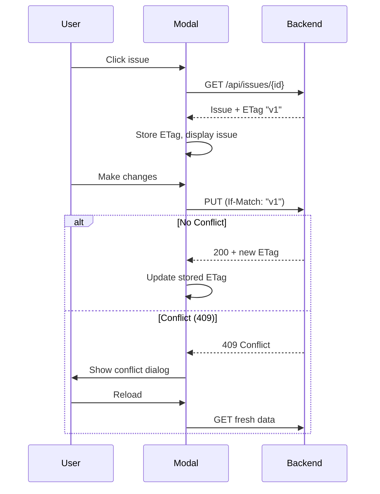

# Concurrency Control (Optimistic Locking)

To ensure data integrity when multiple users edit the same issue simultaneously, we implement optimistic locking using HTTP `ETag` and `If-Match` headers.

## Overview

When the frontend loads an issue, it receives a version identifier (ETag). When saving changes, it sends this ETag back to the server. The server compares the received ETag with the current version in the database:

1.  **Match**: The update proceeds, and a new ETag is generated.
2.  **Mismatch**: The server rejects the update with a `409 Conflict` error, indicating the data has changed since it was loaded.

## Flow Diagram

The following diagram illustrates the interaction between the User, the Modal component, and the Backend API:

## Implementation Details

### Backend
-   **GET /api/issues/{id}**: Returns the issue JSON and sets the `ETag` header based on the `updated_at` timestamp.
-   **PUT /api/issues/{id}**: Checks the `If-Match` header against the current issue's ETag. Returns `409 Conflict` if they do not match.

### Frontend
-   **Fetching**: The `openModal` function fetches the latest issue data and stores the `ETag`.
-   **Saving**: The `saveIssueWithConflictCheck` helper sends the `If-Match` header. If a 409 error occurs, it displays a conflict resolution dialog to the user, allowing them to reload the data.

## Drag-and-Drop Operations

Drag-and-drop operations (board columns, backlog reordering, planning panel) use **last-write-wins** conflict resolution and do **not** use ETag-based optimistic locking.

### Rationale

This approach is acceptable because:
- Concurrent drag conflicts are **rare** in typical usage
- Backend handles it gracefully (last write wins)
- Modal edits already have robust conflict handling for critical changes
- Drags are "quick actions" where last-write-wins is acceptable
- Each user's view auto-refreshes after their drag, reducing stale data window

### Asymmetric Protection

**Important:** Modal edits ARE protected from drag operations:
- If User A opens modal (gets ETag) and User B drags the same issue (updates `updated_at`), then User A saves → **409 Conflict** detected
- User A sees conflict dialog and can reload

This asymmetry is intentional - modal edits represent "careful, intentional changes" and warrant conflict protection, while drags represent "quick reorganization" where last-write-wins is acceptable.
