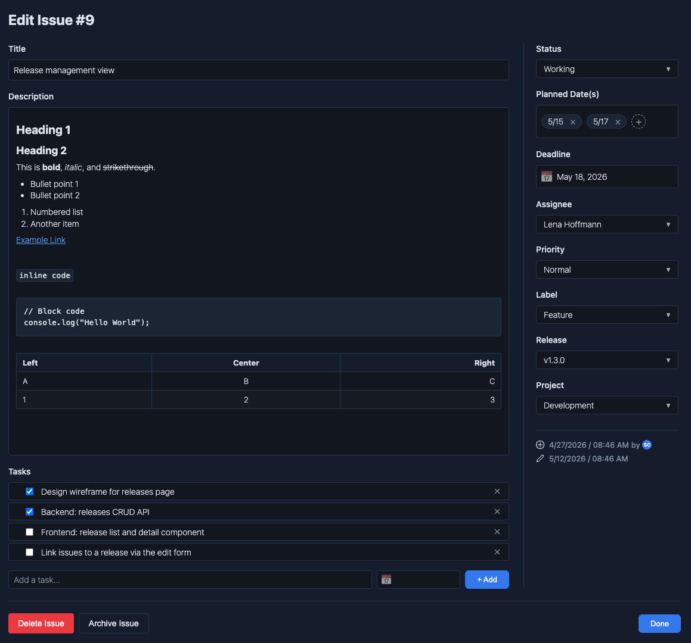
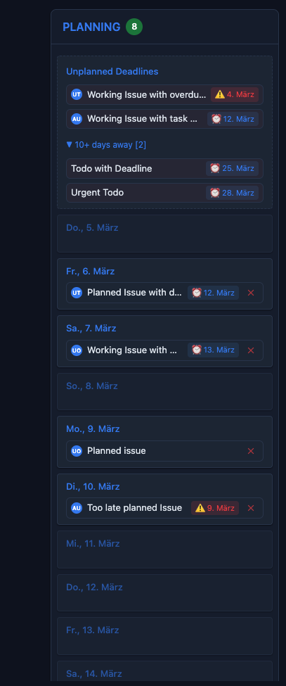
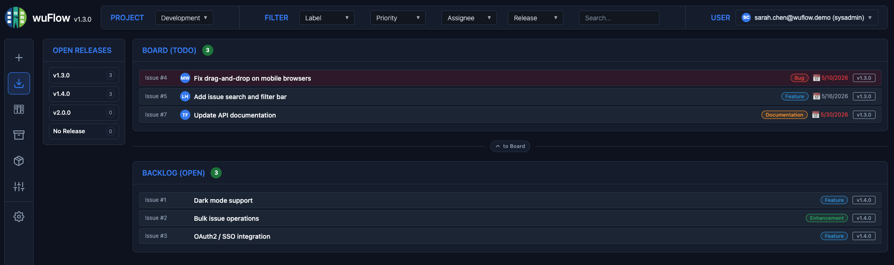
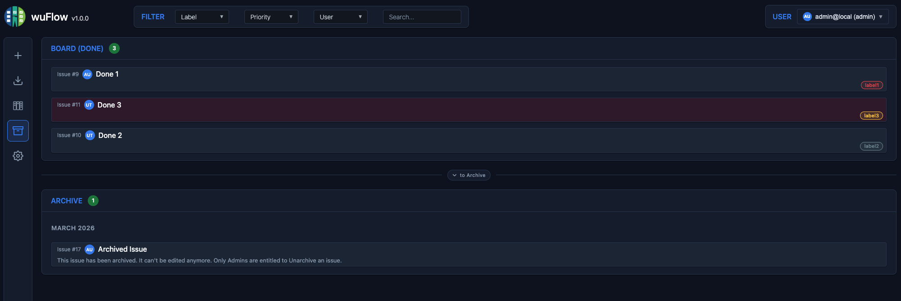
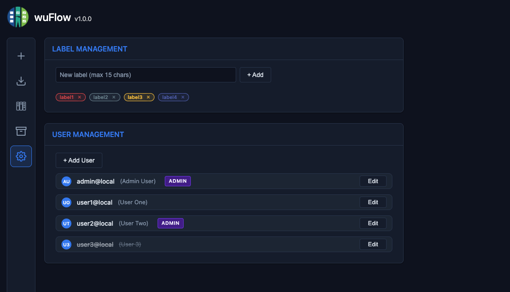

# wuFlow Usage Guide

## First Login & Initial Setup

When you start the application for the very first time, the system automatically creates an initial sysadmin account.
- **Email**: `admin@local` as default or use the one you defined in the `WF_INITIAL_ADMIN_EMAIL` (if using Docker) or `-initial-admin-email` argument when starting the app.
- **Password**: The password you defined in the `WF_INITIAL_ADMIN_PASSWORD` (if using Docker) or `-initial-admin-password` argument when starting the app.

Once you are logged in, it's recommended to navigate to the **Setup View** to adapt the initial user, e.g. setting a new password or to create additional users.
Only users having the sysadmin role are allowed to access the setup view.

## The Interface

wuFlow is built with a clearly arranged layout that combines all relevant information in one view:
- **Main Menu**: In the left sidebar, you can switch between the different views of the application: New issue, Backlog, Board, Archive and Setup
- **Board** (Main view): Displays issues in the usual Kanban style with columns. You can freely drag and drop issues between columns. Click on an issue card to view and adapt details. The board layout changes when you switch to backlog or archive view (see below).
- **Planning Sidebar**: Placed on the right, this simple calendar view allows you to plan issues by dragging them to a specific date. This allows you additionally to plan issues and tasks over the next 10 days, keeping an eye on upcoming deadlines.
- **User Menu**: In the top right corner, there is the menu of the currently logged in user. Currently, password management and log out is available.
- **Project Selection**: Select the project for which you want to see issues on the boards and in the planning sidebar.
- **Filter Bar**: Placed above the board, this bar allows you to filter issues by label, priority, assignee and full text search. The filter influences the shown issue cards and planning entries.

## Managing Issues

### What is an issue?

An issue is a discrete unit of work that tracks a specific task, bug, or requirement from inception to completion. It serves as a centralized record containing essential details like priority, assignee, and status to ensure team alignment. Ultimately, issues function as the fundamental building blocks for collaboration in an agile team, allowing for well balancing the work and guaranteeing an optimal flow in the team.

### Status and Lifecycle of an Issue
The scheme is borrowed from the way how Jira handles issues, but simplified and currently not configurable.
- An issue can have one of the following statuses: **OPEN, TODO, PENDING, WORKING, DONE, ARCHIVED**. 
- When an issue is created, it gets normally the **status OPEN and is placed in the Backlog**.
- The Backlog view allows to organize the backlog (see below) and to **move selected issues from the Backlog to the current board** by changing the status from OPEN to TODO. 
- On the Board, **only issues with status TODO, PENDING, WORKING and DONE are shown**. Drag the issues from left to right according to the progress of work.
- There will be a time, when too many issues are piling up in the DONE column. Then it's time to archive them. This is done in the **Archive view** (see below), where you can drag selected issues from the DONE to the ARCHIVE area. Issues can also be archived in the issue details view.
- When an issue is **archived**, it's still there but **can't be edited anymore**. Users owning the Admin or Sysadmin role can Unarchive issues in special cases.

### Creating Issues
Click the **New Issue** button (plus sign) in the main menu to create a new issue. Each issue contains:
- **Title**: A short summary of the task.
- **Description**: A rich Markdown editor where you can write detailed specifications, embed links, or use formatting. It also supports live preview.

The length of the title (100 chars) and description text (5000 chars) is limited. There is a counter showing the remaining characters in the bottom right corner of the text fields.
Some more fields can be set here, but are optional and can be adapted at any time later, when editing an issue. 
Click on **Save** to create the issue. There will be a green notification toast showing the id of the created issue. If you have not explicitly adapted the Status field, the issue gets the **status OPEN and is therefore placed in the Backlog**. If you want to have the issue on the board right from the start, then assign an appropriate status during issue creation.

### Editing Issues
Click on an issue card to view and adapt details. In addition to title and description, there are these properties available:
- **Status**: The current status of the issue (OPEN, TODO, PENDING, WORKING, DONE). The ARCHIVED status can only be entered in the Archive view or when clicking the "Archive Issue" button.
- **Planned Date(s)**: Here you can assign one or more dates when you intend to work on this issue or define a follow-up date. If set, then the issue is placed in the planning sidebar. As an alternative, the planned date can be set by dragging the issue card on the board onto one of the days in the planning sidebar.
- **Deadline**: Here you can assign a deadline for the issue. If set, then the issue is considered in the planning sidebar. See the Planning section below for more details.
- **Assignee**: At least when the issue arrives on the board, it should get an Assignee. The Assignee user is responsible for the issue. Select one of the configured users. The assignee is shown on the cards with a user badge, built from the first letters of the first and last name. 
- **Priority**: This sets an urgency level for the issue. We only support two levels: **Normal** and **High**. It's fairly useless to have more levels. Usually, teams are only able to cope with these two levels. Issues with High priority are red colored on the board. 
- **Label**: If labels have been created in the Setup view, you can assign them to the issue here. This leads to a colored label badge on the issues card and can be used too as filter criteria. Use labels to either define issue types (story, bug, question etc.) or to separate different topics or domains. So, use labels until features like Releases or EPICs are available.
- **Tasks**: Here you can define subtasks for the issue. See the Tasks section below for more details.

In the bottom right corner there is information when and by whom the issue was created and lastly updated. The user is indicated using the users badge. These fields are automatically filled and can't be edited.

The Issue details view is closed by clicking the DONE button at the bottom of the view. In case of unsaved description changes, you will be asked if you want to save them before closing the view. All other fields are saved automatically.
Additionally, users owning the Admin or Sysadmin role can archive or delete the issue by clicking the Archive or Delete button at the bottom of the view.

### Tasks
We decided against treating (sub)tasks as separate issues like it's done in Jira. We think, that actual (sub)tasks belong fixed to an issue and are just a checklist of things to do. This helps to break issues down into smaller, checkable items.
As a consequence, tasks can only be managed as part of an issue and owns these properties:
- **Title**: A short summary of the task (max. 100 chars).
- **Deadline**: You can optionally assign a deadline only for one task. If set, then the task is considered in the planning sidebar too. See the Planning section below for more details.
- **Done**: If checked, the task is considered done. 

Tasks can also be deleted by clicking the cross icon in the task card. This action can't be undone. Sometimes it's better to delete to clean a long list of already done tasks.

The number of tasks is shown on the Issue card in the Board view. When you hover over this number, then the tasks including possible deadline are listed in a popup.

## Planning Sidebar

We are pretty proud to present the **Planning feature**. It bridges the gap between structured Kanban management and daily planning. Tools like Jira are very good in Kanban, but we always missed an integrated schedule management. Yes, there are deadlines in Jira, but they are not really used to plan the work. When you ask yourself or want to know when someone specifically plans to work on an issue, there is no answer or transparency given by the tool. So, the tool doesn't really support the day-to-day planning or helping you individually to organize your day or week. 

To bridge this gap, wuFlow features a simple, but effective planning view, which is visible together with the Kanban board. 
To use it effectively it is crucial to understand the difference between a **Deadline** and a **Planned Date**.
- A **Deadline** is a hard date, when an issue or a task must be completed. 
- A **Planned Date** is a date, when you intend to work on an issue or want to define a follow-up date (reminder).

Both properties can be used **independently of each other**. So you can have an issue with a deadline but no planned date, or a planned date but no deadline.
Deadlines can be assigned to issues and/or tasks. But **planned dates can only be assigned to issues**.

**How is it done:**
- Start to think over, **when you intend to work on an issue or want to define a reminder**. Then drag and drop the issue card to a **specific day in the planning sidebar**. If you plan for several days, then drag and drop several times to different days. You can also assign planned dates in the Edit issue view.
- When you want to **change your plan**, simply drag and drop the issue card to a different day.
- If you want to **remove an issue from the plan**, then click the red cross in the planning item.

**What else is shown here:**
- In the **Unplanned Deadlines** box at top of the Planning Sidebar, you see all issues with a deadline that **are not planned yet**. This is a kind of warning, that you should plan these issues.
- Unplanned issues due 10+ days away are **hidden behind an expandable item**. This shall avoid too much noise in the Unplanned Deadlines box, especially if the due dates are far in the future.
- **Issue or Task deadlines** are shown in the planning item card. In case of multiple deadlines per issue (issue deadline and task deadline or multiple task deadlines), then only the **earliest deadline** is shown.
- When a task or issue **deadline is overdue** or if the **planned date is later than the due date**, then the deadline is **red-colored**.
- **Planned items in the past** are shown in a dedicated box "Past Planning". You should **delete these entries or move them to another day**.
- Issues with status **Done** remain visible in the planning sidebar but are shown **faded with a strikethrough title**, so you can still see what was accomplished without the entry cluttering your active plan. Use the red cross to remove them once you no longer need them.
- Issues **planned more than 10 days in the future** are collected in a box "Future Planning" at the bottom of the Planning Sidebar.
- There is a **mutual highlighting** when hovering over a planning item or an issue on the board.

If there are many users active on the board, the entries in the planning sidebar could be overwhelming. In that case, you can filter the planning sidebar to show only your issues. When you select your name in the filter box, then only your issues are considered and you can see your personal plan for the coming days and weeks. 

 

## The Backlog View

According to the issue lifecycle above, the backlog is usually the starting point for all issues. Here, all ideas, planned topics, issues not yet ready to work etc. are collected in the backlog. 
To keep the board clean, only issues ready to work on should be on the board. INVEST is a checklist often used to determine if a user story meets the DoR (Definition of Ready) criteria:
- **I**ndependent
- **N**egotiable
- **V**aluable
- **E**stimable
- **S**mall
- **T**estable

Use the Backlog view to review your backlog and plan your work. Usually, a "Backlog Grooming" is held in the team to review the backlog, discuss and decide about priority and readiness for the board. 
On the Backlog view, you can:
- **Create** new issues by clicking the "New Issue" button.
- **Adapt Priority** by changing the order of the issues.
- **Move** issues from the backlog to the board by dragging them to the TODO area. This makes them visible in the TODO column of the Board
- **Filter** issues by label, priority, assignee or text search.

## The Archive View

Once an issue is completed (DONE status) and no longer needed on the board, you can archive it. This hides the issue from the active views while keeping it stored for future reference. Archived issues are not deleted; they can be reviewed, searched, or even restored to the board at any time.
The Archive View is similar to the Backlog View, but the other way round: Issue to be archived are moved from top (DONE area) to bottom (ARCHIVE area). By this, the issue vanishes from the board and is instead visible in the Archive area, sorted and grouped per month of archiving.
Archiving a bunch of DONE issues could be done along with a kind of a review process in the team or celebrating the completion of a project or milestone. 
Archived issues are read-only. Users owning the Admin or Sysadmin role are entitled to **restore** archived issues to the board. This is done by clicking the "Restore" button in the Issue details view.

## The Setup View

The Setup View is only available for users with sysadmin role and allows to configure **projects**, **labels** and **users**.

### Projects
Projects group issues into separate workstreams or areas of responsibility. Each issue belongs to exactly one project. A **default project** (id=1) is always present and cannot be deleted.
- **Create** a new project by entering a name (max 15 characters) and an optional description (max 100 characters), then click "Save".
- **Rename or update** a project by clicking on it, changing the values, and saving. The project name must be unique.
- **Delete** a project by clicking "Delete". Deletion is only possible if no issues are currently assigned to that project. The default project cannot be deleted.

### Labels
Create labels which can be used in issues to categorize and color-code them. The label name is limited and the color is randomly generated. Labels can't be edited, only deletion is possible.

### Users
Users can be created, adapted or deactivated here. 
- When you **create a new user**, enter the properties, assign a role, set an initial password and click "Save". Then the user can log in using Email and password and should then be requested to set an own password. 
- To **adapt an existing user**, click on the user in the list, adapt what you want, and click "Save". Here, a sysadmin can re-define a new password for a user, when e.g. a user has forgotten their password.
- To **deactivate a user**, click on the user in the list and click "Deactivate". This is useful when a user is no longer active in the team or organization. Deactivated users can't log in and are not visible in the user list to be assigned for issues. Deletion of users is currently not supported.

## User Roles
When a new user is created a role is assigned. Three roles are available, ordered from least to most privileged:
It is a conscious decision, that every user can see all issues and tasks to support transparency and easy collaboration. Maybe we add a feature to create "private" issues in the future.

| Action | User | Admin | Sysadmin |
| :--- | :---: | :---: | :---: |
| View issues & tasks | ✓ | ✓ | ✓ |
| Create / edit issues | ✓ | ✓ | ✓ |
| Create / edit / delete tasks | ✓ | ✓ | ✓ |
| View labels, users & projects | ✓ | ✓ | ✓ |
| **Archive** an issue | — | ✓ | ✓ |
| **Unarchive** an issue | — | ✓ | ✓ |
| **Delete** an issue | — | ✓ | ✓ |
| Create / delete labels | — | — | ✓ |
| Create / edit / deactivate users | — | — | ✓ |
| Create / update / delete projects | — | — | ✓ |
| Access Setup view | — | — | ✓ |
