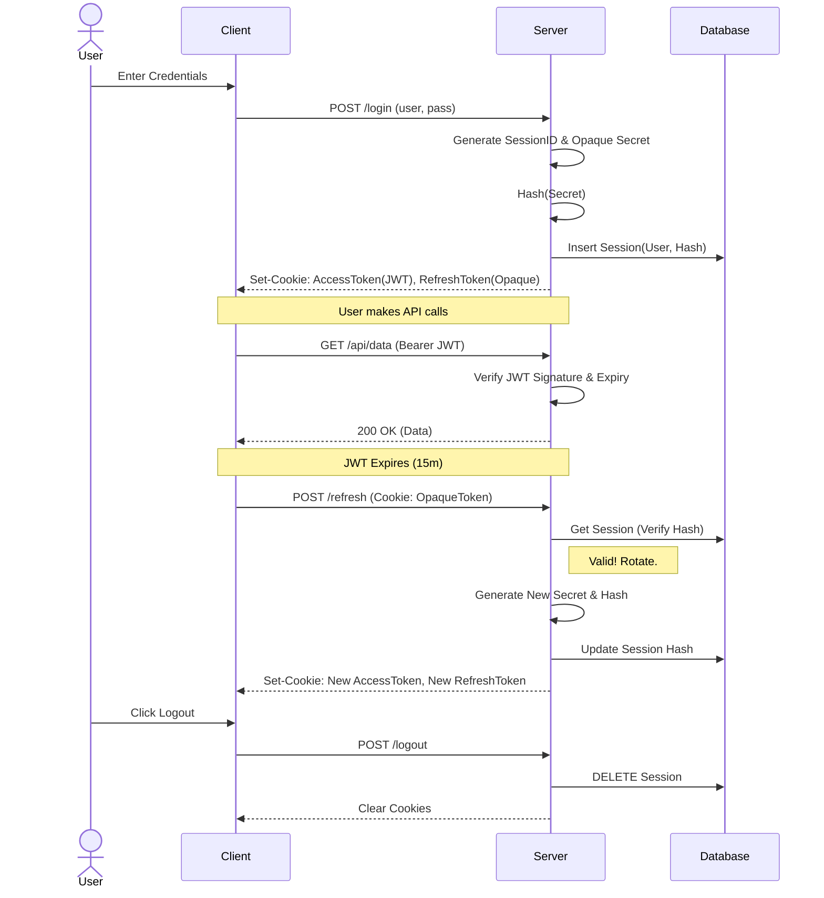
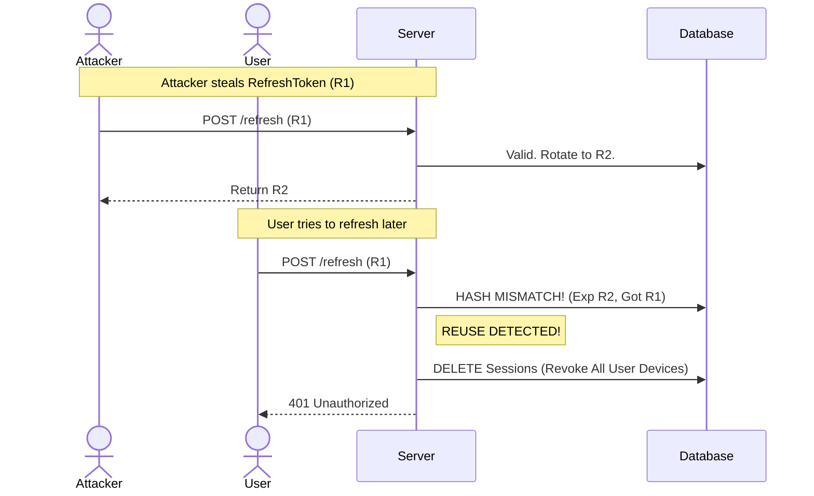

# User Management (Authentication & Authorization)

## Overview

wuFlow applies a **Hybrid Authentication** model using HTTPOnly cookies.
- **Access** is stateless (JWT).
- **Sessions** are stateful (Opaque Tokens stored in DB), allowing for secure revocation and rotation.
- Access is restricted by user roles.

## User Roles and Authorization

Three roles are available, ordered from least to most privileged:

| Action | User | Admin | Sysadmin |
| :--- | :---: | :---: | :---: |
| View issues & tasks | ✓ | ✓ | ✓ |
| Create / edit issues | ✓ | ✓ | ✓ |
| Create / edit / delete tasks | ✓ | ✓ | ✓ |
| View labels, users & projects | ✓ | ✓ | ✓ |
| Archive an issue | — | ✓ | ✓ |
| Unarchive an issue | — | ✓ | ✓ |
| Move an issue to another project | — | ✓ | ✓ |
| Delete an issue | — | ✓ | ✓ |
| Create / delete labels | — | ✓ | ✓ |
| Configure board columns | — | ✓ | ✓ |
| Access Project Settings view | — | ✓ | ✓ |
| List releases | ✓ | ✓ | ✓ |
| View a single release | ✓ | ✓ | ✓ |
| Create / edit / delete releases | — | ✓ | ✓ |
| Publish / reopen a release | — | ✓ | ✓ |
| Create / edit / deactivate users | — | — | ✓ |
| Create / update / delete projects | — | — | ✓ |
| Access System Settings view | — | — | ✓ |

> **Notes**:
- The `/api/auth/me` endpoint (Get Current User / Update Self) is available to **all authenticated users** regardless of role. Any user can view and update their own profile (e.g. change password). Changing the password requires the user to supply their **current password** for confirmation.
- **Admin and sysadmin** users see the Project Settings navigation item (label management, scoped per project).
- Only **sysadmin** users see the System Settings navigation item (user management, projects).
- The **Releases view** is accessible to all authenticated users to support team-wide visibility into planned and completed deliveries. However, only **admin and sysadmin** users can create, edit, delete, publish, or reopen releases — regular users have read-only access.
- The **sysadmin** role is a super-admin: it has all permissions of both Admin and User.

### Authorization Concept

Authorization is enforced by a single **allowlist policy table** in `backend/permissions.go`. Every HTTP operation is mapped to a named action constant (e.g. `ActionArchiveIssue`), and each action explicitly lists the roles that may perform it. The `Can(role, action)` function is the sole entry point — no role logic lives in individual handlers.

Each handler evaluates `Can()` at the **method-dispatch level**, before any database access. A missing or insufficient role always results in `403 Forbidden` before any side effects occur.

The frontend mirrors this policy in `static/js/permissions.js` via `userCan(user, action)`. UI elements (archive/delete buttons, drag-drop targets) are hidden or blocked on the client side, while the backend remains the authoritative enforcement point.

## Initial Sysadmin

On first startup (when the users table is empty), wuFlow creates the initial sysadmin account based on the following configuration:

```bash
WF_INITIAL_ADMIN_EMAIL=admin@example.com WF_INITIAL_ADMIN_PASSWORD=YourSecurePass123! ./wuflow
```

| Setting | Environment Variable | CLI Parameter | Default | Notes |
| :--- | :--- | :--- | :--- | :--- |
| **Email** | `WF_INITIAL_ADMIN_EMAIL` | `--initial-admin-email` | `admin@local` | Optional argument to overwrite the default, must be a valid email address |
| **Password** | `WF_INITIAL_ADMIN_PASSWORD` | `--initial-admin-password` | *(Required)* | Mandatory argument for the first startup, must meet password policy (see below) |

The email address and password of the initially created sysadmin user can be changed after login in the System Settings page.

> **Migration note**: Existing installations that have user id=1 with role `admin` are automatically upgraded to `sysadmin` on first startup after the update.

## Authentication Flow

The **Hybrid Authentication** model shall achieve the following goals:
- **Access Tokens**: Short-lived, stateless JWTs (JSON Web Tokens) for high-performance API authentication without database access.
- **Refresh Tokens**: Long-lived, stateful **Opaque Tokens** (Random Strings) backed by a database session for enhanced security and convenience for the user to automatically create new short-lived access tokens without re-entering credentials.

### 1. Normal Operation


1. **Login**: User submits credentials. Server creates a **Session** in the database and returns two HTTPOnly cookies.
2. **Access**: The stateless JWT is used for API requests. Validation is fast (CPU only, no DB).
3. **Refresh (Rotation)**: When the JWT expires, the client sends the Opaque Refresh Token.
    - The server looks up the session in the DB.
    - **Rotation**: If valid, a **NEW** Refresh Token is generated, and the old one is invalidated immediately.
    - This "Sliding Session" keeps the user logged in as long as they are active.
4. **Logout**: The session is permanently deleted from the database.

### 2. Security Features

#### Opaque Refresh Tokens
Unlike JWTs, the Refresh Token is a random string (`base64(session_id:secret)`).
- **Database Storage**: Only an **HMAC-SHA256** digest of the secret is stored, keyed with a token MAC key derived from the server's secret key (domain-separated HMAC-KDF — independent from the JWT signing key).
- **Leak Protection**: Even if the database is leaked, attackers cannot generate valid refresh tokens without also knowing the server's secret key.

#### Cryptographic Primitives

| Credential | Algorithm | Key / Cost |
| :--- | :--- | :--- |
| User passwords | bcrypt | Default cost (~300 ms) |
| JWT access tokens | HMAC-SHA256 (HS256) | Derived from `secretKey` via domain-separated HMAC-KDF |
| Refresh token integrity | HMAC-SHA256 | Derived from `secretKey` via domain-separated HMAC-KDF |

#### Reuse Detection (Anti-Theft)
If an attacker steals a Refresh Token and uses it, the legal user (or the attacker) will eventually try to use the *same* (now reused) token again.
- The server detects that an **old** token is being presented.
- **Action**: The server assumes theft and **immediately revokes ALL sessions for that user** (Family Revocation).
- **Result**: Both the attacker and the victim are logged out from all devices, preventing further unauthorized access.



#### Rate Limiting & Brute Force Protection
To protect against credential stuffing and brute force attacks while preventing targeted Denial of Service (DoS), the application employs rate limiting at two layers:

**Login endpoint** — dual-layer strategy:
1. **Per-IP Limit**: Maximizes at 20 failures per 15 minutes. Returns a fast `429 Too Many Requests` to shed load and stop automated botnets.
2. **Per-IP & Email Limit**: Maximizes at 10 failures per 15 minutes. Returns a generic `401 Unauthorized` to prevent attackers from locking out legitimate users from arbitrary IP addresses.
   - **Timing Side-Channel Protection**: When this limit is hit (or when a requested account doesn't exist or is inactive), the server executes a "dummy" password hash. This intentionally burns the exact same CPU time (~150ms) as a real login attempt, completely hiding the rate-limit or account status from the attacking client's network timing measurements.
   - **Reset-on-success scope**: Only the per-IP+Email counter is cleared on a successful login. The global per-IP counter persists so an attacker cannot reset IP-wide throttling by authenticating with a secondary account.
   - **Reverse Proxy Support**: If `wuFlow` is deployed behind a proxy or CDN, use `--remote-ip-header=X-Forwarded-For` (or `WF_REMOTE_IP_HEADER=X-Forwarded-For`) to ensure the actual client IP is used for rate limiting. If this setting is not provided, the application defaults to the direct connection IP (`r.RemoteAddr`). This is only safe when wuFlow's port is exclusively reachable through the trusted proxy **and** the proxy overwrites (not appends to) the header with the real client IP.

**Authenticated API endpoints** — per-user write limit:
- Write requests (`POST`, `PUT`, `DELETE`) are limited to **60 per minute per authenticated user**. Read-only `GET` requests are not counted.
- Exceeding the limit returns `429 Too Many Requests`.
- Rate limiting can be disabled with `--api-rate-limit=false` (or `WF_API_RATE_LIMIT=false`), e.g. during automated test runs.

### Token Details

| Token | Duration | Purpose | Storage |
| :--- | :--- | :--- | :--- |
| **Access Token** | 15 minutes | API Authentication | Stateless (JWT) |
| **Refresh Token** | 24 hours | Session Renewal | Stateful (DB Hash) |

- **Stolen JWT**: Because access tokens are stateless, a stolen JWT could be used by an attacker, but only for a **maximum of 15 minutes**, greatly reducing the window of opportunity.
- **Idle Timeout**: If a user is inactive for >24 hours, their session expires and they must re-login.
- **Active Sessions**: As long as the user uses the app once every 24 hours, the session effectively never expires (Sliding Window).
### Token Refresh Details

1. **API Requests**: The frontend uses a 401 interceptor with a mutex to catch expired access tokens. It calls `/api/auth/refresh` once, then retries all pending requests. This avoids race conditions (Token Reuse Detection) during concurrent API calls.
2. **Static Page Loads**: On browser refresh or direct navigation, the server automatically checks the refresh token cookie. If valid, it refreshes the session and serves the page immediately without a redirect. This ensures a seamless initial load.

### Custom Secret Key

By default, a random secret key is generated on every startup. This key serves as the master key material from which two independent operational keys are derived via domain-separated HMAC-KDF: one for signing JWT access tokens, and another for computing HMAC integrity hashes for refresh tokens. Without a configured key, all sessions are invalidated on restart and users must re-login. To persist sessions across restarts, provide a stable key:

```bash
WF_SECRET_KEY=your-secure-random-string ./wuflow
```

The key should be a long, random string (32+ characters recommended).

## Password Policy

- Minimum **12 characters**
- Must **not** be the user's email address
- Must **not** be a commonly used password (checked against a blacklist)

## User Lifecycle

- Sysadmins can create, edit, activate, and deactivate users via the System Settings view.
- **Inactive users** cannot log in.
- **Sensitive action confirmation**: To prevent a stolen session from being weaponised, certain sysadmin actions require the requesting sysadmin to confirm their **own current password** (`admin_password`):
  - Changing another user's password
  - Promoting a user's role (`user→admin`, `user→sysadmin`, `admin→sysadmin`)
- **Session Revocation**: The following actions trigger immediate revocation of **all** user sessions (Family Revocation):
  - Deactivating a user
  - Changing a user's password (self-service or admin-initiated)
  - **Changing a user's role** (any direction)
  - Detecting **Token Reuse** (suspected theft)
- **Note**: Existing Access Tokens remain valid until they expire (max 15 minutes). When the client attempts to refresh the token, the request will fail (401), causing the application to log the user out.
